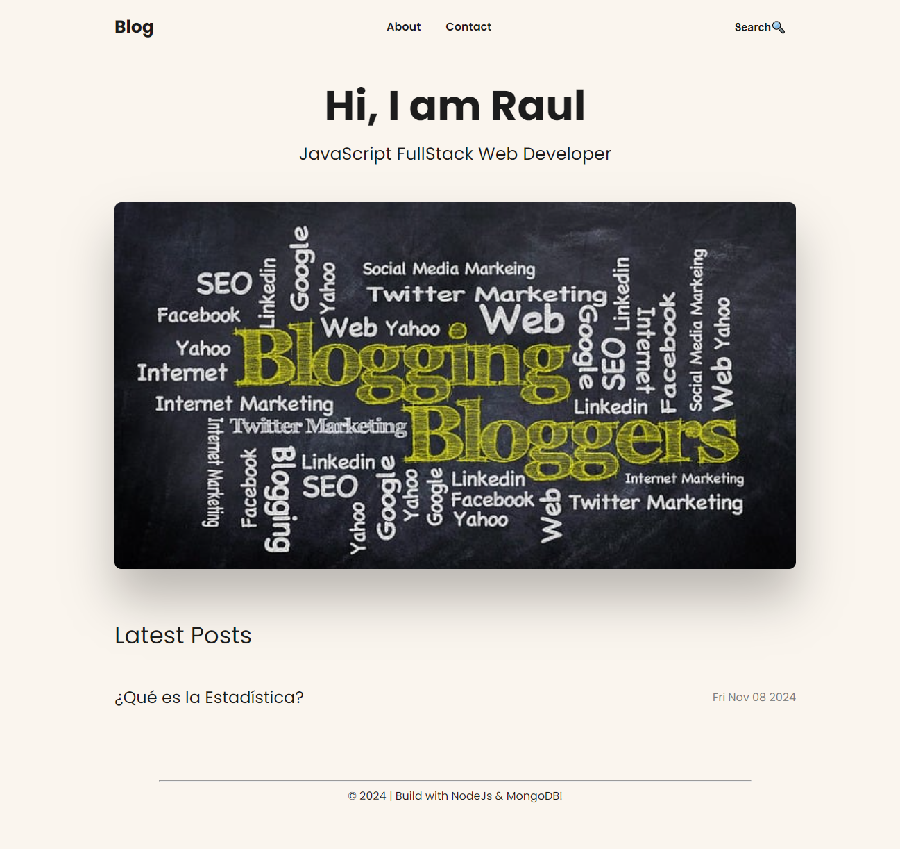
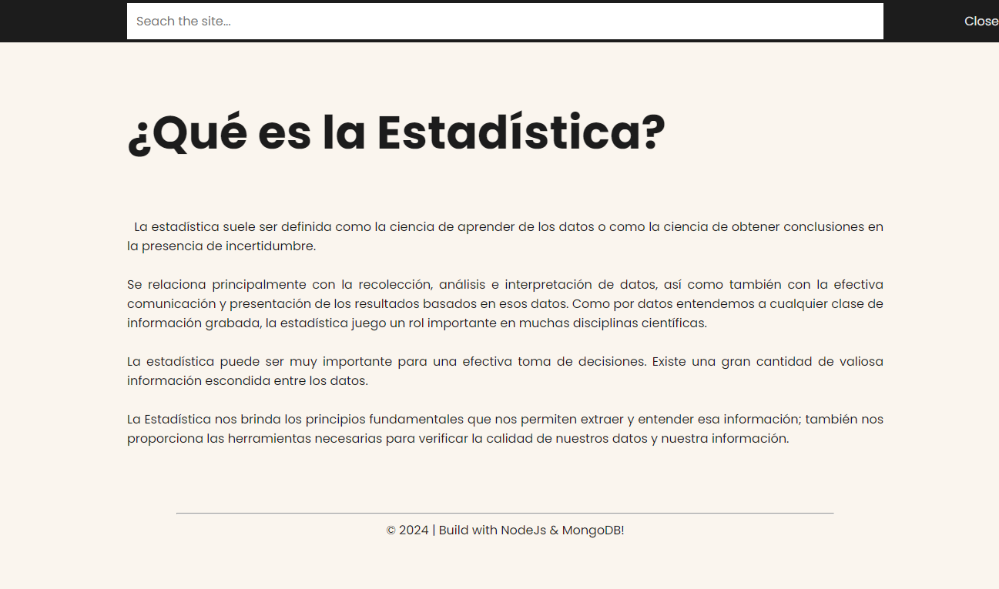
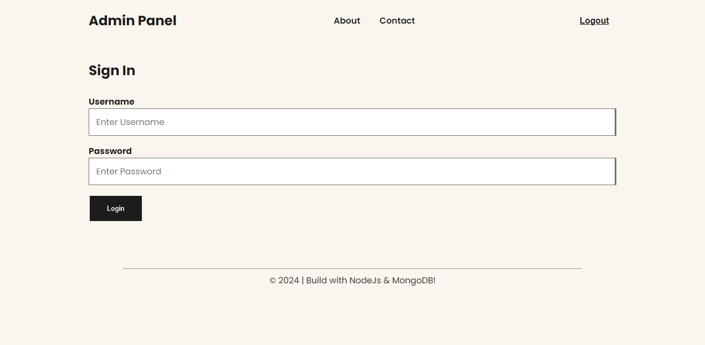
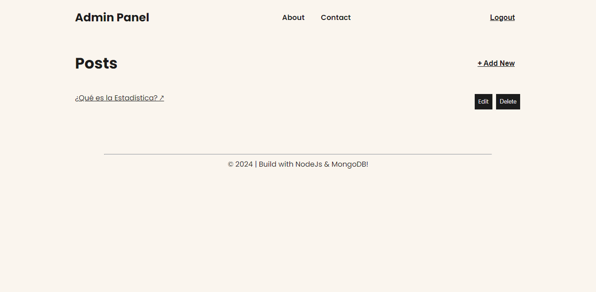
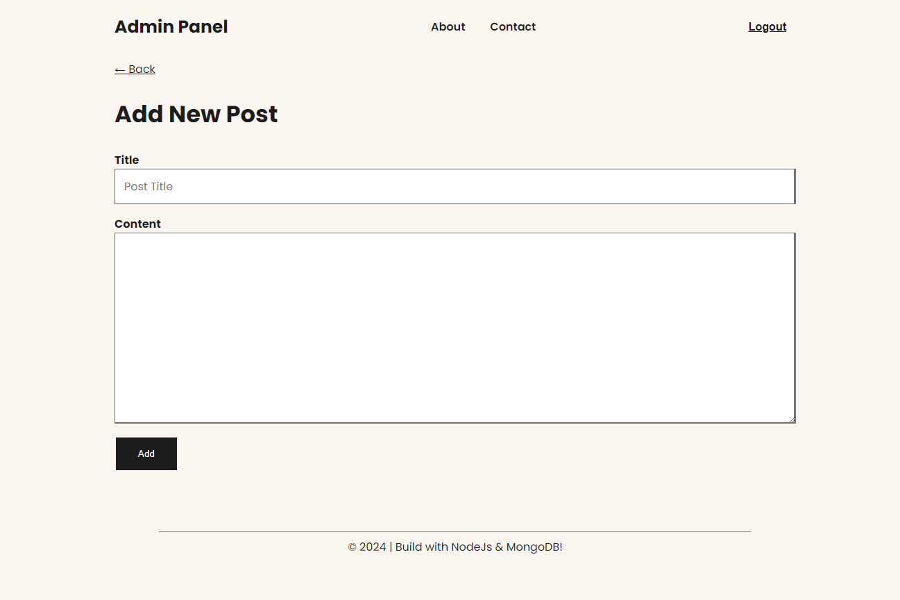
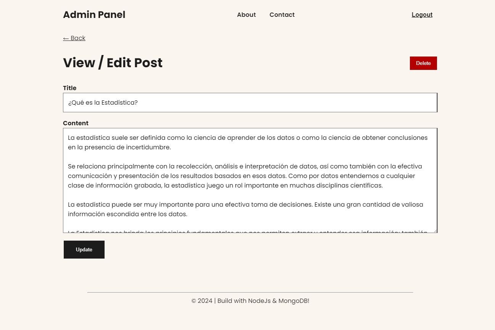

# Project Summary

**Blog-App Server Project**: This project is about how to make a Blog application using ExpressJs as Backend to establish the API with its routes and the Ejs Page engine and Mongo DB as a data repository

# Project Objectives

The project follows **three learning objectives** :

1. How to create functional crud with Express usong APIs
2. How to communicate data and functions between APIs and view Ejs engine
3. How to validate and authenticate a user with Tokens using JWT
 
# Requirements

Have knowledge of Javascript, Html and CSS

# Technical Requirements

- Node Js
- MongoDB
- Ejs
- Jwt

# Preview

### Initial Main Screen 

### Post Screen with Search Bar

### Login (Validating User to Admin Panel)

### Admin Panel (Add, Edit and Erase Posts)

### Create post Screen

### Editin Post Screen

***
